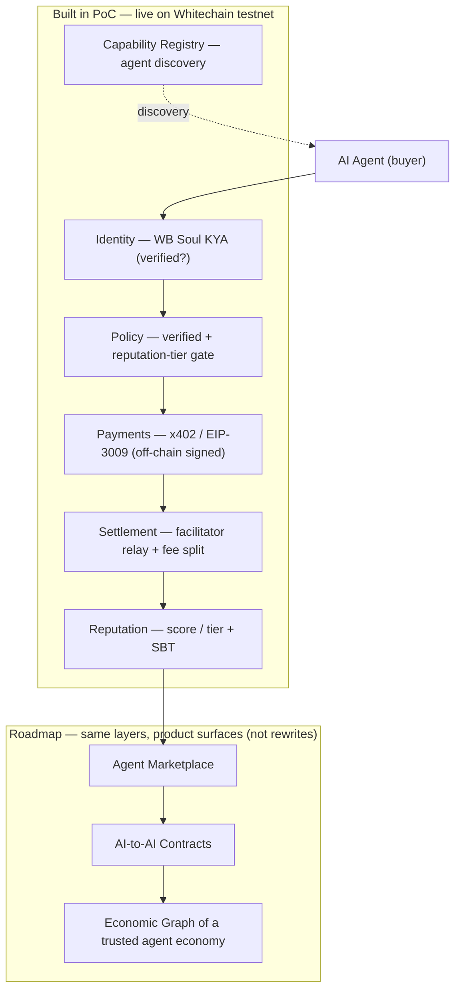

# Why AgentPay belongs on Whitechain — defensibility

> Companion to the README's *Problem / Solution / North-star* sections. This is
> the part reviewers and ecosystem leads actually press on: **the moat and the
> network effect** — why this can't just be copy-pasted onto another chain.

## The problem, sharpened

An AI agent is spun up in **seconds**: anonymous, no track record, no legal
accountability. [x402](https://x402.org) made agents able to *pay*; it did
nothing to make them *trustworthy*. For any regulated business — a bank, a
marketplace, an exchange like WhiteBIT — that is the blocker: **you cannot let
an unknown piece of software move value on your rails.** Without a trust layer,
autonomous agent commerce stays a toy. The same agent can pay you 0.01 or drain
a wallet and vanish, and nothing on-chain tells you which one you are dealing
with. LLMs can't assess counterparty trust; agents can't be held accountable;
and without reputation, an agent economy can't scale past hobby volumes.

**AgentPay's answer:** no verified identity → no payment. Full stop, regardless
of a correct signature or a correct amount.

## The moat: identity you can gate a payment on

An x402 payment service on *any* EVM chain is a commodity — Coinbase, or anyone,
can rebuild a payment router in a weekend. What is **not** copy-pasteable to Base
or Polygon is a payment **gated on real, on-chain identity.**

Whitechain has **WB Soul**: KYA identity + soul-bound reputation, anchored to
WhiteBIT's actual KYC. AgentPay refuses to settle unless the payer holds a
verified WB Soul. That gate only exists on the chain that *issues* the identity.

> The defensibility isn't the code. It's the network that issues trusted agent
> identity — and that's Whitechain, not a fork of it.

## The network effect: trust compounds where identity lives

Every verified agent and every settled payment writes to on-chain reputation. As
more agents transact through this layer on Whitechain:

- a verified Whitechain identity becomes **more valuable** — a portable
  reputation counterparties already trust;
- new agents have **more reason to verify here** than to stay anonymous
  elsewhere;
- and the cost of leaving for an identity-less chain **rises** — you'd abandon
  the reputation you built.

Payments are undifferentiated; **reputation is sticky.** The flywheel isn't
"more payments" — it's "more trusted identities anchored to one chain." That is
the compounding advantage a competitor can't clone by copying the payment code.

## Why this matters to WhiteBIT specifically

WhiteBIT's direction is to be the leading provider of blockchain solutions and
liquidity, with tokenized assets settling on Whitechain. Those assets are inert
until something *operates* them — and in an agent economy that "something" is
autonomous agents transacting continuously. AgentPay is the primitive that lets
them do it **only when the counterparty is a verified, accountable agent.** It
turns WB Soul from a compliance checkbox into the foundation of an agent economy
on Whitechain.

## The whole system in 30 seconds

*Built today = the shaded core (identity → policy → payment → settlement →
reputation + one provider + registry), deployed and run end-to-end on Whitechain
testnet. See [`TESTNET_DEPLOYMENT.md`](TESTNET_DEPLOYMENT.md).*
