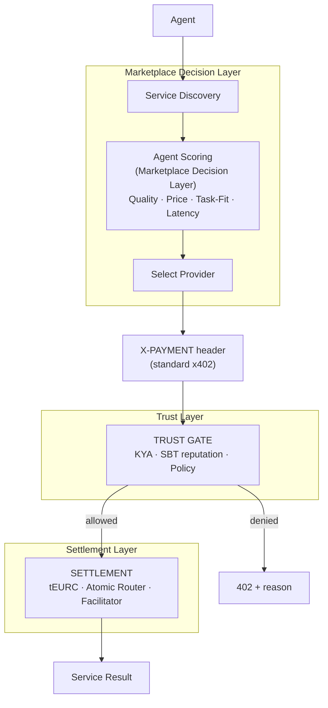
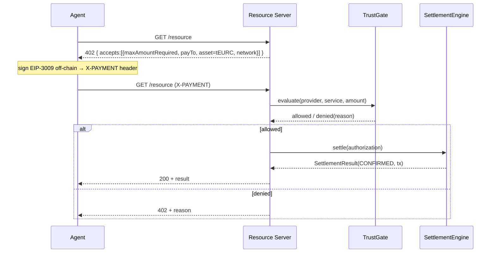

# Unified AgentPay — architecture (Phase 1: canonical interfaces)

This document defines the **canonical architecture** that unifies two existing,
independently-working AgentPay layers, and the interfaces that let them compose
without a big-bang rewrite. Phase 1 is **design only** — the `unified/` package is
Protocols/models, not wiring; no existing code, contract, or `main` is changed.

## Confirmed decisions

| Decision | Value |
|---|---|
| Canonical settlement token | **tEURC** (production). apUSD retained as dev/test + compatibility asset. |
| Public payment protocol | **standard x402 `X-PAYMENT` header** (not the bespoke JSON body) |
| Marketplace decision layer | Quality / Price / Task-Fit / Latency scoring — **kept** (ran real testnet payments) |
| Trust layer | KYA (WB Soul) + SBT reputation + policy — a **gate**, not a replacement for scoring |
| Separation rule | **Quality Score ≠ Trust Score.** Never mixed. |

## The two layers being unified

- **Marketplace / Decision layer** (from `local-agentpay-import`): service
  discovery, a registry with observed quality metrics, and a multi-factor scoring
  engine that lets an agent *economically choose* between providers. Standard x402.
- **Trust / On-chain layer** (this branch's base): WB Soul KYA, on-chain SBT
  reputation, atomic tEURC settlement (C-1 closed), a hardened facilitator.

They are **complementary layers of one product**, both on Whitechain testnet.

## Target model

**Quality vs Trust, concretely:** *WeatherPremium* — rating 4.9, success 99.8%,
latency 90 ms — is **quality**. *Provider has KYA, SBT tier, N successful
settlements, 0 disputes* — is **trust**. A future ranking may become
`Final ≈ Quality × Price × Task-Fit × Trust`, but the weights are to be derived
**experimentally** (Phase 3+), not invented. Today: `final = marketplace score`,
and Trust is a hard **gate**.

## Components & interfaces (`unified/`)

| Interface | File | Role |
|---|---|---|
| `Provider`, `Service` | `models.py` | Canonical model; every field tagged with its source of truth (`FieldSource`: provider-supplied / registry-supplied / on-chain-verified / calculated). |
| scoring functions | `scoring.py` | `quality_score`, `price_score`, `task_fit`, `trust_score`, `marketplace_final_score`, `compose_final_score`. Local behaviour preserved exactly; Trust separate. |
| `TrustGate` | `trust_gate.py` | `evaluate(provider, service, requested_amount, min_tier) -> TrustDecision`. Hard allow/deny from KYA+SBT+policy. Never computes quality. |
| `X402PaymentAdapter` | `payment.py` | Translates the standard x402 `X-PAYMENT` protocol ↔ internal `PaymentAuthorization`. |
| `SettlementEngine` | `settlement.py` | Hides facilitator/router/token/atomic details behind `settle(authorization) -> SettlementResult`. |

### Field provenance (who may set what)

- **provider-supplied** (self-asserted → must be signature-bound): name, url,
  endpoint, price, category, `provider_id`, `pay_to`.
- **registry-supplied** (observed): `rating`, `success_rate`, `latency_ms`,
  allowlist. *Quality metrics are registry-observed, not seller-declared*, so they
  can't be trivially gamed.
- **on-chain-verified** (authoritative): `kya_status`, `soul_id`,
  `sbt_reputation_tier`, `signer`.
- **calculated**: `trust_tier` (= max(SBT, behavioral)), all scores.

## Data flow

1. **Service discovery** — the agent asks the registry for services in a category
   under a budget. The registry returns candidates with quality metrics; records
   are signature-bound (the GitHub `id == signer` rule) so a listing can't be spoofed.
2. **Scoring (marketplace)** — `compose_final_score` ranks candidates by
   quality/price/task-fit. Trust is *not* in this number.
3. **Select provider** — highest final score; the provider's signed `pay_to` is pinned.
4. **Payment (standard x402)** — the agent hits the resource, gets a 402, and
   replies with an `X-PAYMENT` header (EIP-3009 authorization signed off-chain).
5. **Trust gate** — before settling, `TrustGate.evaluate` checks KYA + SBT tier +
   policy. Denied → 402 with a buyer-safe reason. Allowed → continue.
6. **Settlement** — `SettlementEngine.settle` moves tEURC on-chain (atomic router
   or legacy relay, hidden from the caller) and returns a `SettlementResult`.
7. **Service result** — the resource is released on confirmation.

## Payment flow (standard x402)

## Trust flow

`TrustGate` reads WB Soul (`soulOf`, IsVerified) and the SBT/behavioral tier,
applies policy/allowlist, and returns an explicit `TrustDecision` (allowed,
reason, kya_status, reputation_tier, policy_decision). It performs **no** money
movement and computes **no** quality. Effective tier = `max(SBT-attested,
behavioral)` (carried over from the trust layer).

## Failure modes

| Failure | Handling |
|---|---|
| No verified KYA / below tier | TrustGate denies → 402 + reason; no settlement attempted |
| Malformed `X-PAYMENT` header | adapter raises `ValueError` → 400 (never 500) |
| Bad signature / wrong amount | rejected pre-settlement (EIP-3009 recovery + amount check) |
| Settlement relay fails | `SettlementResult(FAILED)` with buyer-safe reason (RPC/revert detail to logs only) |
| Atomic split reverts | all-or-nothing — nothing moves; `FAILED` |
| Legacy relay ok, forward fails | `FUNDS_HELD` — journaled, reconcilable, no silent loss |
| Registry record unsigned/spoofed | discovery filters it (signature not bound) |

## Security boundaries

- **Marketplace ↔ Trust:** the scoring engine cannot grant access; only `TrustGate`
  can. Quality never launders a missing KYA.
- **Provider claims ↔ verified facts:** self-asserted fields are only trusted when
  signature-bound; quality metrics are registry-observed; KYA/SBT are on-chain.
- **Buyer ↔ settlement:** the buyer signs an authorization but never learns
  blockchain internals; `SettlementEngine` is the only component that moves funds,
  and atomic mode binds destination/amount/fee to the signature (C-1).
- **Money:** integer minimal units everywhere; no float on any money path.
- **Secrets:** keys/tokens via env only; buyer-safe reasons only to clients;
  internal detail to logs.

## Asset compatibility (`PaymentAsset = tEURC | apUSD`)

`tEURC` is the production default and the only asset a production `SettlementEngine`
must support. `apUSD` (the local `AgentPayUSD` token) is retained as a dev/test and
compatibility asset — the `PaymentAsset` enum and the `Service.currency` field keep
it representable so the existing local end-to-end flow stays reproducible during
integration. It is **not** removed.

## Invariant across all phases

After every phase, this must still be reproducible end-to-end:
`agent → discovery → x402 → payment → settlement → result`. The working testnet
flow is a product asset; no refactor may quietly break it.
